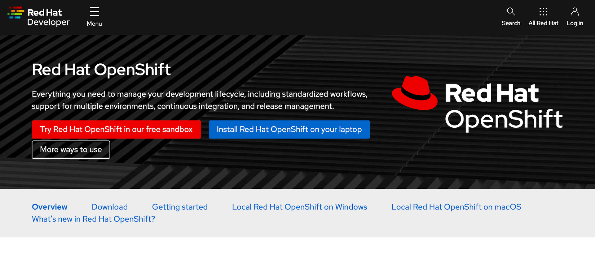
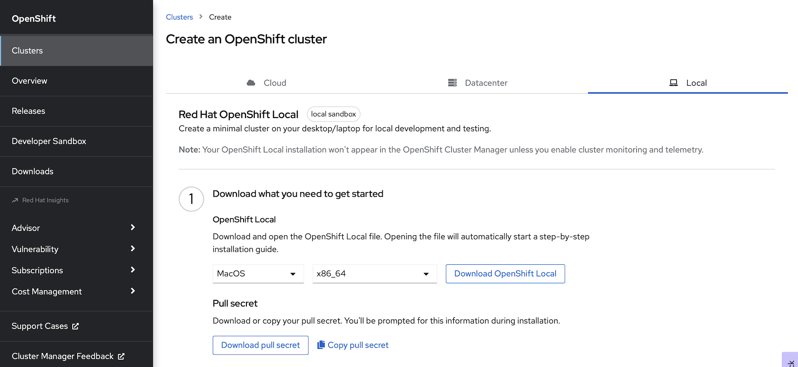
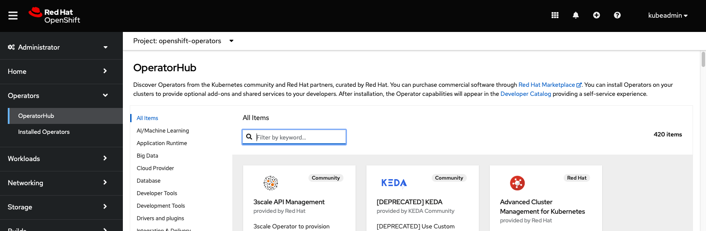
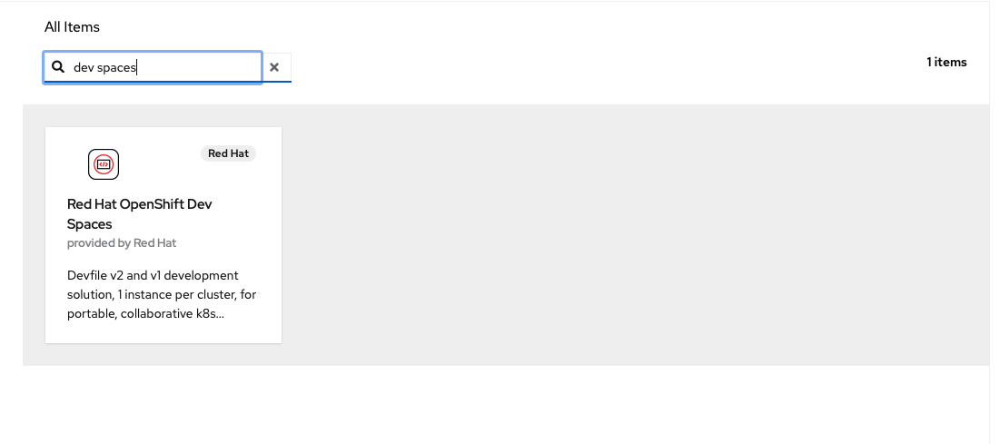
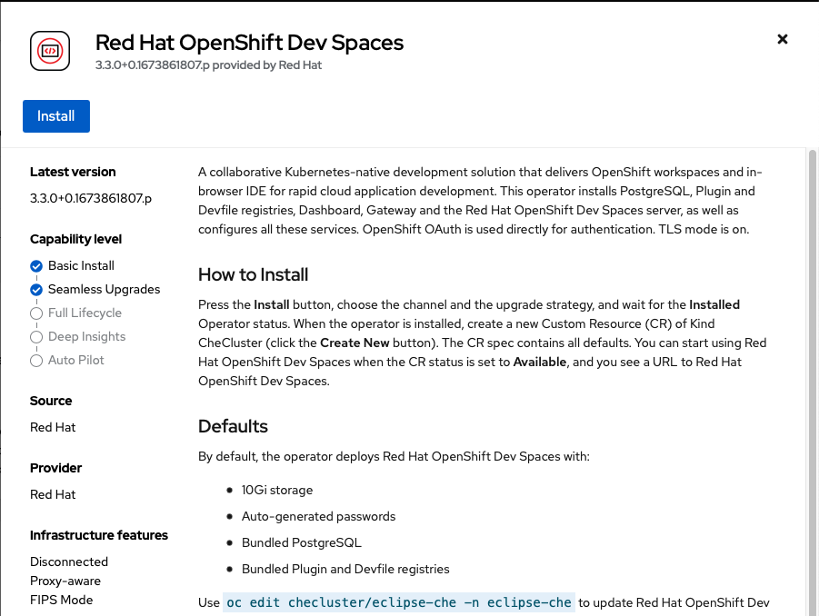
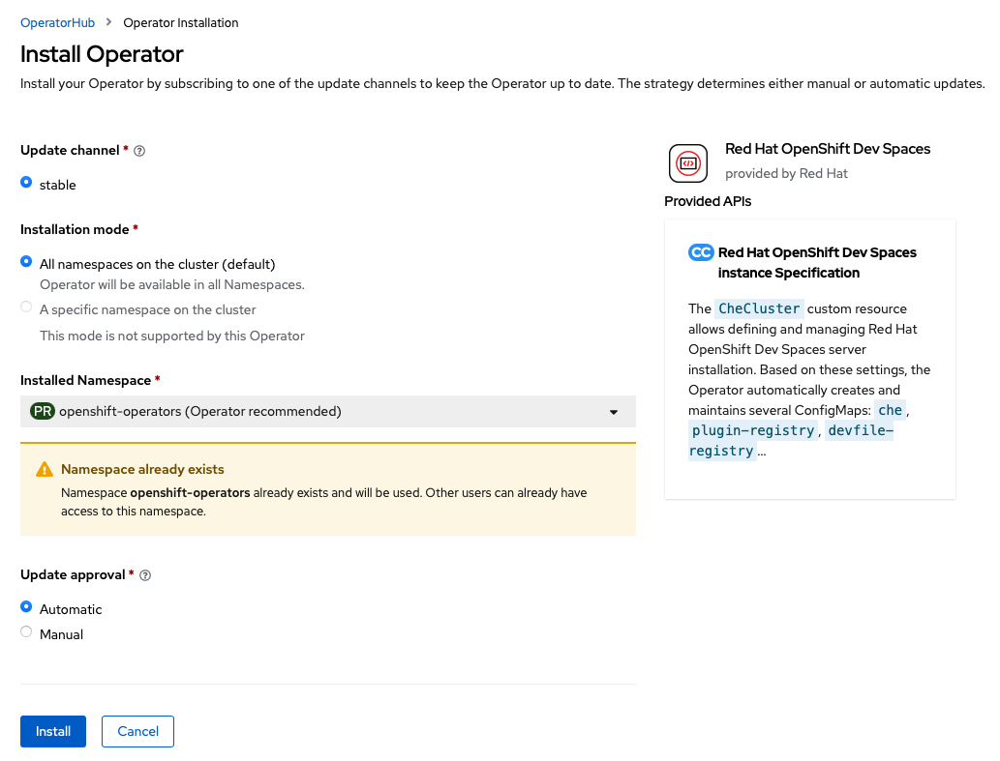
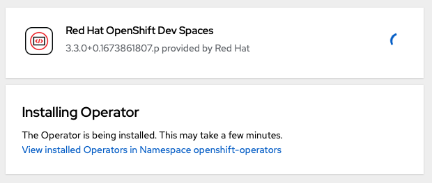
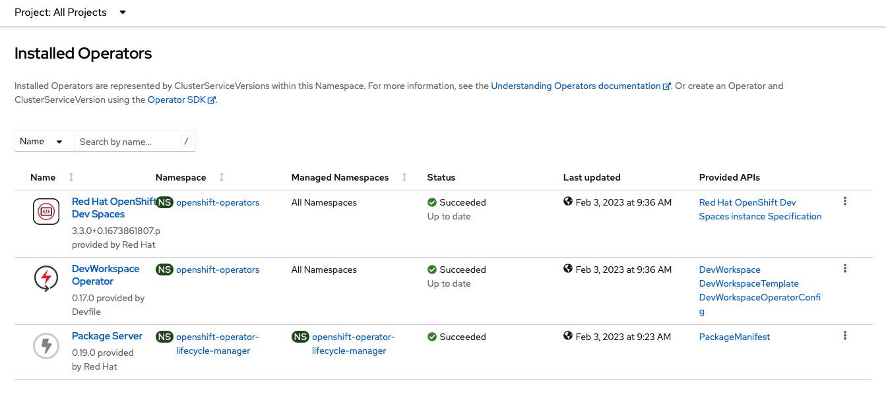

# Install & Configure OpenShift Local

1. Go To: [https://developers.redhat.com/products/openshift/overview](https://developers.redhat.com/products/openshift/overview){:target="_blank"}

   

1. Select `Install Red Hat OpenShift on your laptop`

   This will take you to a login page.  If you don't have a Red Hat developer account you will register for one here.  It's free and you'll get access to a lot of ebooks, guides, and tools.

1. From the landing page after you log in, you will need to download two things:

   1. Download the OpenShift Local installation package for your OS and architecture

   1. Download your pull secret.  This will give you access to all of the Operators in the Red Hat operator catalog.

   

1. Install OpenShift Local with the installation package that you downloaded.

1. Open a terminal and prepare your workstation to run the cluster:

   ```bash
   crc setup
   ```

   __Note:__ This will take a while.  OpenShift Local will first download the latest cluster bundle, decompress it, and set up your system to run the cluster.

1. Configure your OpenShift Local cluster: __Note:__ You need at least 16GB of RAM on your workstation, 32GB is better. 

  Adjust the settings below based on your workstation config.

  If you only have 16GB of RAM, change `memory 16384` to `memory 12288`.

  If you only have 2 CPU cores, (4 threads), then change `cpus 6` to `cpus 4`

   ```bash
   crc config set cpus 6
   crc config set memory 12288
   crc config set disk-size 100
   crc config set kubeadmin-password crc-admin
   ```

1. Start OpenShift Local:

   ```bash
   crc start
   ```

   After the cluster starts, you should see output similar to:

   ```bash
   INFO All operators are available. Ensuring stability... 
   INFO Operators are stable (2/3)...                
   INFO Operators are stable (3/3)...                
   INFO Adding crc-admin and crc-developer contexts to kubeconfig... 
   Started the OpenShift cluster.

   The server is accessible via web console at:
     https://console-openshift-console.apps-crc.testing

   Log in as administrator:
     Username: kubeadmin
     Password: crc-admin

   Log in as user:
     Username: developer
     Password: developer

   Use the 'oc' command line interface:
     $ eval $(crc oc-env)
     $ oc login -u developer https://api.crc.testing:6443
   ```

## Install the OpenShift Dev Spaces Operator

1. Launch the OpenShift console in your browser:

   ```bash
   crc console
   ```

1. Log in with user: `kubeadmin`, password: `crc-admin`

1. Navigate to the `Operator Hub`

   

1. Type `dev spaces` into the search, and select `Red Hat OpenShift Dev Spaces`:

   

1. Click `Install`:

   

1. Click `Install`:

   

   The Operator should begin installing:

   

1. Observe the installed Operators, by clicking on `Installed Operators`  underneath `Operator Hub` in the left nav menu bar:

   

## Create the OpenShift Dev Spaces CheCluster Instance

1. Open a terminal and login to the OpenShift Local instance with the CLI:

   ```bash
   oc login -u kubeadmin -p crc-admin https://api.crc.testing:6443
   ```

   ```bash
   cat << EOF | oc apply -f -
   apiVersion: v1
   kind: Namespace
   metadata:
     name: openshift-devspaces
   ---
   apiVersion: org.eclipse.che/v2
   kind: CheCluster
   metadata:
     name: devspaces
     namespace: openshift-devspaces
   spec:
     components:
       cheServer:
         debug: false
         logLevel: INFO
       database:
         credentialsSecretName: postgres-credentials
         externalDb: false
         postgresDb: dbche
         postgresHostName: postgres
         postgresPort: '5432'
         pvc:
           claimSize: 1Gi
       metrics:
         enable: true
     containerRegistry: {}
     devEnvironments:
       secondsOfRunBeforeIdling: -1
       containerBuildConfiguration:
         openShiftSecurityContextConstraint: container-build
       disableContainerBuildCapabilities: false
       defaultEditor: che-incubator/che-code/insiders
       defaultNamespace:
         autoProvision: true
         template: <username>-devspaces
       secondsOfInactivityBeforeIdling: 1800
       storage:
         pvcStrategy: per-workspace
     gitServices: {}
     networking: {}
   EOF
   ```
