# Demo for Quarkus Dev Mode in OpenShift Dev Spaces / Eclipse Che

This project is a quick demo to show you how you can leverage Quarkus Dev Services in [OpenShift Dev Spaces](https://developers.redhat.com/products/openshift-dev-spaces/overview) / [Eclipse Che](https://www.eclipse.org/che/).

If you are not familiar with Quarkus Dev Services, check it out here: [https://quarkus.io/guides/dev-services](https://quarkus.io/guides/dev-services)

Because running nested containers is not yet supported in OpenShift without completely trashing its security posture, we are going to use a clever resource to assist us.  Check out the `Kubedock` project.  It is going to allow us to mimic a running Docker service in our Dev Spaces environment.  [https://github.com/joyrex2001/kubedock](https://github.com/joyrex2001/kubedock)

## Prerequisite

You will need access to an OpenShift cluster with the Dev Spaces or Eclipse Che operator installed.

You can run this on your local workstation by using OpenShift Local.  It will be a bit sluggish because you're running a LOT of infrastructure on a single node, but it does work.  The more CPU and RAM you can give it the better.  I ran it with 16GB of RAM and 6 CPUs while developing this demo.

Follow these instructions to set up OpenShift Local: __[Install OpenShift Local and OpenShift Dev Spaces](./InstallCRC.md)__

## Setup to Run The Demo

Before we run the demo, there are a few things to set up.

We are going to:

* Create a namespace for OpenShift Dev Spaces workspace container images.
* Grant all service accounts in the cluster permission to pull images from the new namespace
* Create a BuildConfig of a Quarkus tooling image
   We are doing this partially to save time during deployment, to avoid pulling a large image across the internet.  But, also to show you that you can...
   __Note:__ The custom workspace image that we are going to create includes `Kubedock` which is an essential part of this demo.
* Build the Quarkus Tooling Image

1. You don't need cluster admin privileges for this.  You can run it as a normal user with namespace provisioning privileges, which are enabled out of the box.

   If you are using OpenShift local, log in from a terminal as the `developer` user.

   ```bash
   oc login -u developer https://api.crc.testing:6443
   ```

1. Create a namespace to hold workspace container images:

   ```bash
   cat << EOF | oc apply -f -
   apiVersion: v1
   kind: Namespace
   metadata:
     name: eclipse-che-images
   EOF
   ```

1. Create a RoleBinding to grant permission for service accounts to pull images from this namespace:

   ```bash
   cat << EOF | oc apply -f -
   apiVersion: rbac.authorization.k8s.io/v1
   kind: RoleBinding
   metadata:
     name: system:image-puller
     namespace: eclipse-che-images
   roleRef:
     apiGroup: rbac.authorization.k8s.io
     kind: ClusterRole
     name: system:image-puller
   subjects:
   - apiGroup: rbac.authorization.k8s.io
     kind: Group
     name: system:serviceaccounts
   EOF
   ```

1. Create an ImageStream for a Quarkus tooling image

   ```bash
   cat << EOF | oc apply -f -
   apiVersion: image.openshift.io/v1
   kind: ImageStream
   metadata:
     name: quarkus
     namespace: eclipse-che-images
   EOF
   ```

1. Create the BuildConfig for our Quarkus image.

   Note two things here:

   1. We are using an embedded Dockerfile to build the image.

   1. We are grabbing files from two other images and copying them into our new image.

      __Note:__ I have created an image in my Quay.io account which has the tooling for this workspace demo in it.  The image is a `From scratch` image which is used purely as a container to hold files to be added to other images.  You can see the Dockerfile and build script for it in the `./quarkus-tools` directory of this project.  I sometimes do this to provide packaging for environments that have limited internet access.  It's a great way to ensure consistent versioning, and provide security scanning for the open source tooling that you might pull from Github for example.

   ```bash
   cat << EOF | oc apply -f -
   apiVersion: build.openshift.io/v1
   kind: BuildConfig
   metadata:
     name: quarkus
     namespace: eclipse-che-images
   spec:
     source:
       dockerfile: |
         FROM registry.access.redhat.com/ubi9/ubi-minimal
         ARG USER_HOME_DIR="/home/user"
         ARG WORK_DIR="/projects"
         ARG JAVA_PACKAGE=java-17-openjdk-devel
         ARG USER_HOME_DIR="/home/user"
         ARG WORK_DIR="/projects"
         ARG TOOLS_IMAGE="quay.io/cgruver0/che/quarkus-tools"
         ARG TOOLS_IMAGE_TAG="latest"
         ARG OC_IMAGE="image-registry.openshift-image-registry.svc:5000/openshift/cli"
         ARG OC_IMAGE_TAG="latest"
         ENV HOME=\${USER_HOME_DIR}
         ENV BUILDAH_ISOLATION=chroot
         ENV LANG='en_US.UTF-8' LANGUAGE='en_US:en' LC_ALL='en_US.UTF-8'
         ENV MAVEN_HOME=/usr/share/maven
         ENV MAVEN_CONFIG="\${HOME}/.m2"
         ENV GRAALVM_HOME=/usr/local/tools/graalvm
         ENV JAVA_HOME=/etc/alternatives/jre_17_openjdk
         # copy Maven, Graalvm, Quarkus CLI, Kubedock, and some other tools from my quarkus tools image.
         COPY --from=\${TOOLS_IMAGE}:\${TOOLS_IMAGE_TAG} /tools/ /usr/local/tools
         # Copy the OpenShift CLI from the cli image in the internal registry
         COPY --from=\${OC_IMAGE}:\${OC_IMAGE_TAG} /usr/bin/oc /usr/bin/oc
         RUN microdnf --disableplugin=subscription-manager install -y openssl compat-openssl11 libbrotli git tar gzip zip unzip which shadow-utils bash zsh wget jq podman buildah skopeo glibc-devel zlib-devel gcc libffi-devel libstdc++-devel gcc-c++ glibc-langpack-en ca-certificates \${JAVA_PACKAGE}; \
           microdnf update -y ; \
           microdnf clean all ; \
           mkdir -p \${USER_HOME_DIR} ; \
           mkdir -p \${WORK_DIR} ; \
           mkdir -p /usr/local/bin ; \
           setcap cap_setuid+ep /usr/bin/newuidmap ; \
           setcap cap_setgid+ep /usr/bin/newgidmap ; \
           mkdir -p \${HOME}/.config/containers ; \
           (echo '[storage]';echo 'driver = "vfs"') > \${HOME}/.config/containers/storage.conf ; \
           touch /etc/subgid /etc/subuid ; \
           chmod -R g=u /etc/passwd /etc/group /etc/subuid /etc/subgid ; \
           echo user:20000:65536 > /etc/subuid  ; \
           echo user:20000:65536 > /etc/subgid ; \
           chgrp -R 0 /home ; \
           chmod -R g=u /home \${WORK_DIR}
         USER 10001
         ENV PATH=\${PATH}:/usr/local/tools/bin
         WORKDIR \${WORK_DIR}
     strategy:
       type: Docker
     output:
       to:
         kind: ImageStreamTag
         name: quarkus:latest
   EOF
   ```

1. Build the image:

   ```bash
   oc start-build quarkus -n eclipse-che-images -F
   ```

## Log into OpenShift Dev Spaces

Next, we need to log into OpenShift Dev Spaces.  We not going to do anything with it yet, because we need to make a change to the namespace that Dev Spaces will provision for us.

1. Get the URL for the dev-spaces route:

   ```bash
   echo https://$(oc get route devspaces -n openshift-devspaces -o jsonpath={.spec.host})
   ```

1. Paste that URL into your browser and click `Log in with OpenShift`

   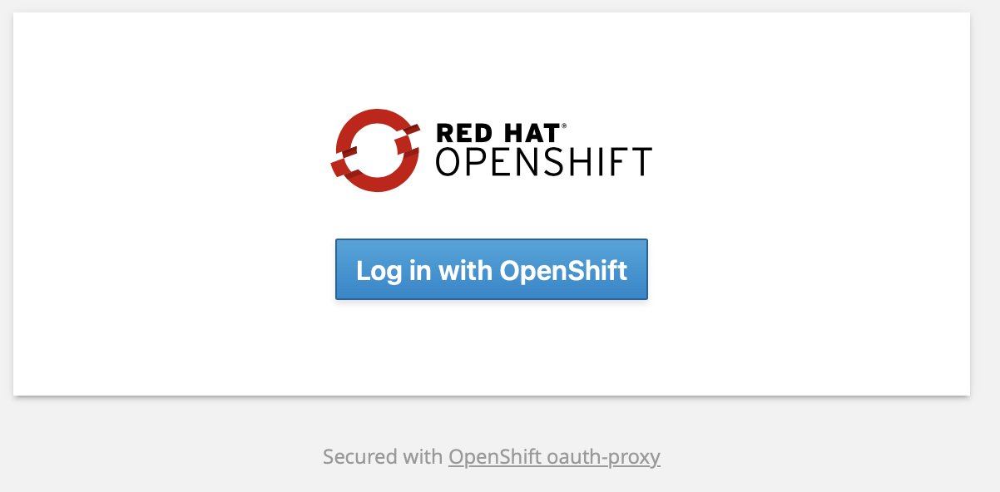

1. Log in with user: `developer`, password: `developer`:

   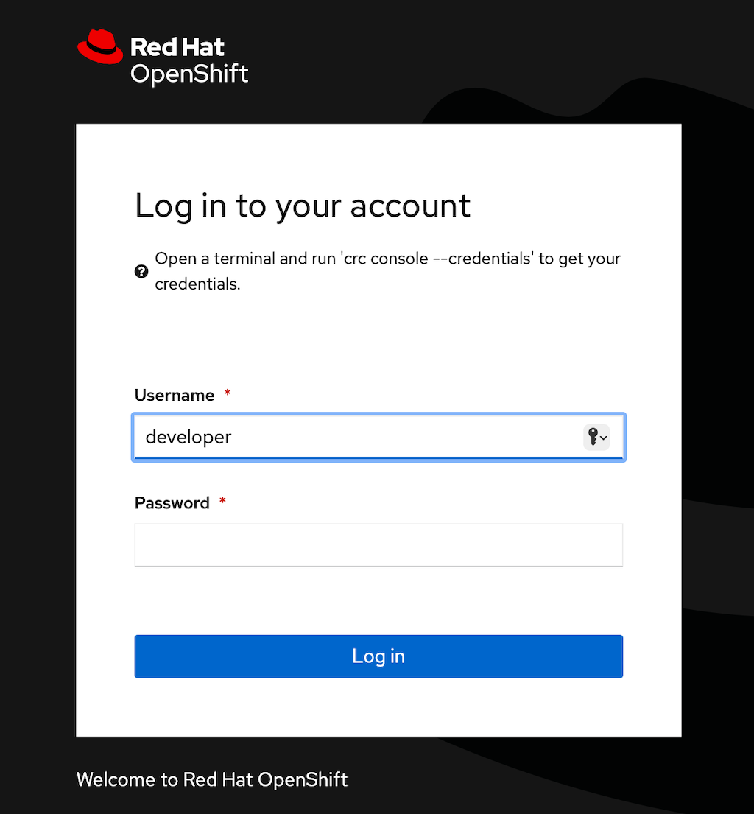

1. The first time, you will be asked to authorize access:

   Click `Allow selected permissions`:

   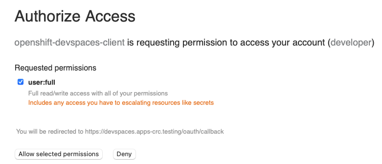

1. You should now be at the Dev Spaces dashboard:

   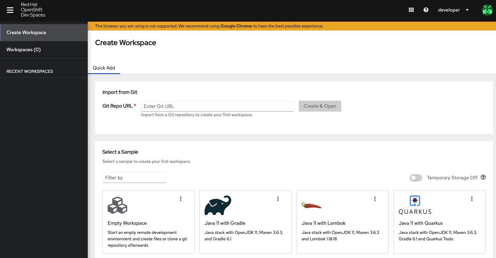

## Add a role to your user

At this point we need to take a quick detour back to the terminal with `cluster-admin` privileges.  One capability that `Kubedock` needs in order to enable Quarkus Dev Services is not yet in Dev Spaces.  We need the ability to create `port-forward` from a pod in our namespace back to a running shell in our workspace.  The `Kubedock` utility that we are using, also needs the ability to list Jobs in our namespace.

Let's add that ability now, by creating a new `ClusterRole`, and binding our user to it in the namespace that Dev Spaces has provisioned for us.

1. Open a terminal and login to the OpenShift cluster as a user with `cluster-admin` privileges:

   If you are using OpenShift Local, it looks like this:

   ```bash
   oc login -u kubeadmin https://api.crc.testing:6443
   ```

   __Note:__ If you followed my OpenShift Local install instructions, then your `kubeadmin` password is `crc-admin`.  If you did your own install, the you can get the password by running: `crc console --credentials`

1. Create the cluster role:

   ```bash
   cat << EOF | oc apply -f -
   apiVersion: rbac.authorization.k8s.io/v1
   kind: ClusterRole
   metadata:
     name: quarkus-dev-services
   rules:
   - apiGroups:
     - batch
     resources:
     - jobs
     - jobs/status
     verbs:
     - get
     - list
     - watch
   - apiGroups:
     - ""
     resources:
     - pods/portforward
     verbs:
     - get
     - list
     - watch
     - create
     - delete
     - deletecollection
     - patch
     - update
   EOF
   ```

1. Add that role to your user in the provisioned namespace:

   ```bash
   oc policy add-role-to-user quarkus-dev-services developer -n developer-devspaces
   ```

## Create A Workspace

Now, we are ready to create a namespace and run the demo:

1. Go back to the Dev Spaces dashboard that we logged into previously:

   

1. In the `Import from Git` form, paste the Git URL for this project:

   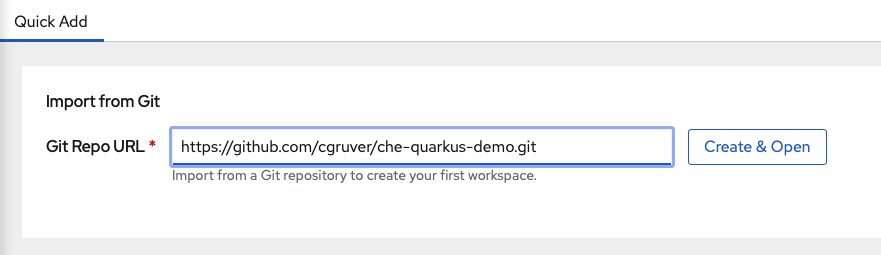

1. You should now see the workspace starting:

   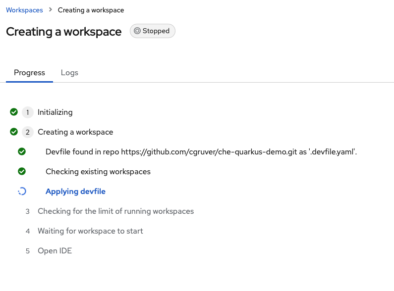

1. After the workspace starts, you should see the VS Code landing page:

   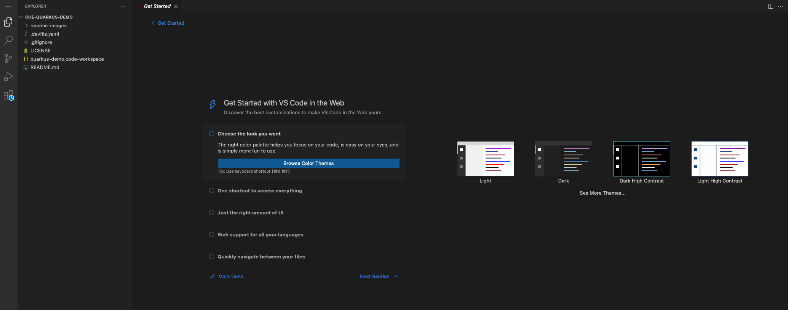

1. There is a very simple VS Code workspace file included with this project.  Dev Spaces will detect this and prompt you to open the workspace:

   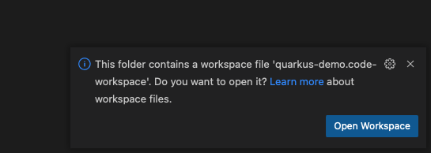

## Demo Quarkus Dev Services for Integration Testing

I have included code for a simple Quarkus app that will use a KeyCloak OIDC provider service as part of the integration testing for this demo.  Check out the OIDC dev service here: [https://quarkus.io/guides/security-openid-connect-dev-services](https://quarkus.io/guides/security-openid-connect-dev-services)

The code for the REST resource and test are below:

`src/test/java/org/acme/GreetingResourceTest.java`

```java
package org.acme;

import io.quarkus.test.junit.QuarkusTest;
import org.junit.jupiter.api.Test;
import static io.restassured.RestAssured.given;
import static org.hamcrest.CoreMatchers.is;
import io.quarkus.test.keycloak.client.KeycloakTestClient;

@QuarkusTest
public class GreetingResourceTest {

    KeycloakTestClient keycloak = new KeycloakTestClient();

    @Test
    public void testHelloEndpoint() {
        given()
          .auth().oauth2(getAccessToken("alice"))
          .when().get("/hello")
          .then()
             .statusCode(200)
             .body(is("Hello from RESTEasy Reactive"));
    }
    protected String getAccessToken(String user) {
        return keycloak.getAccessToken(user);
    }
}
```

`src/main/java/org/acme/GreetingResource.java`

```java
package org.acme;

import javax.ws.rs.GET;
import javax.ws.rs.Path;
import javax.ws.rs.Produces;
import javax.ws.rs.core.MediaType;
import io.quarkus.security.Authenticated;
import javax.annotation.security.RolesAllowed;

@Path("/hello")
@Authenticated
public class GreetingResource {

    @GET
    @Produces(MediaType.TEXT_PLAIN)
    @RolesAllowed({"user","admin"})
    public String hello() {
        return "Hello from RESTEasy Reactive";
    }
}
```

### Run the Demo

1. In the top left of your workspace, open a Terminal:

   Select `New Terminal`

   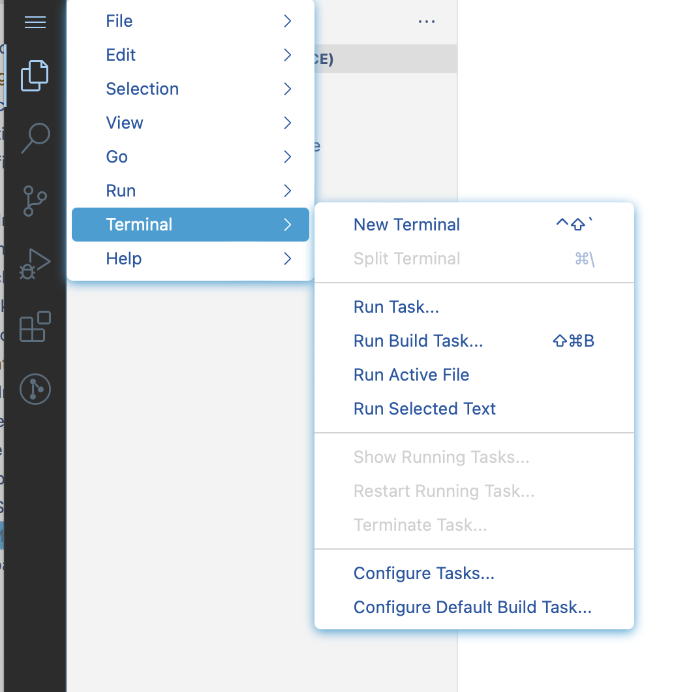

1. In the bottom left menu of the terminal pane, open a split terminal:

   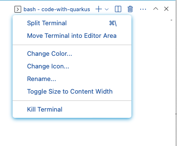

1. In the right hand terminal, start the `kubedock` server:

   ```bash
   kubedock server --port-forward
   ```

   __Note:__ You can answer `No` to the dialogs that pop up about port redirects during this demo:

   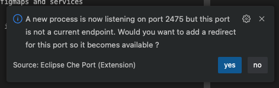

1. In the left hand terminal, set the environment vars for `kubedock`:

   ```bash
   export TESTCONTAINERS_RYUK_DISABLED=true
   export TESTCONTAINERS_CHECKS_DISABLE=true
   export DOCKER_HOST=tcp://127.0.0.1:2475
   ```

1. In the left hand terminal, run the tests for the demo app:

   ```bash
   mvn test
   ```

1. Observe the tests run against a KeyCloak server provisioned by `kubedock`:

   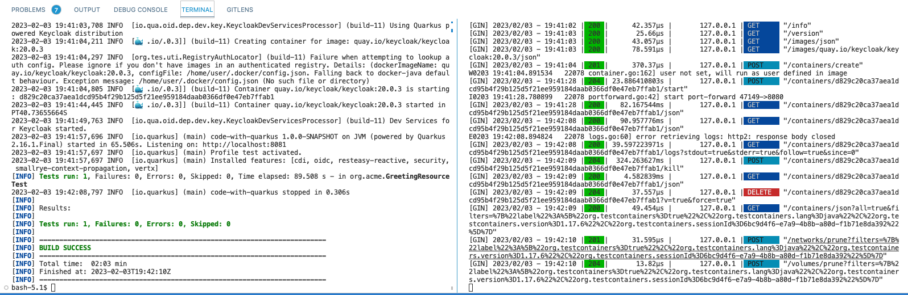

Pretty cool! Right!?
