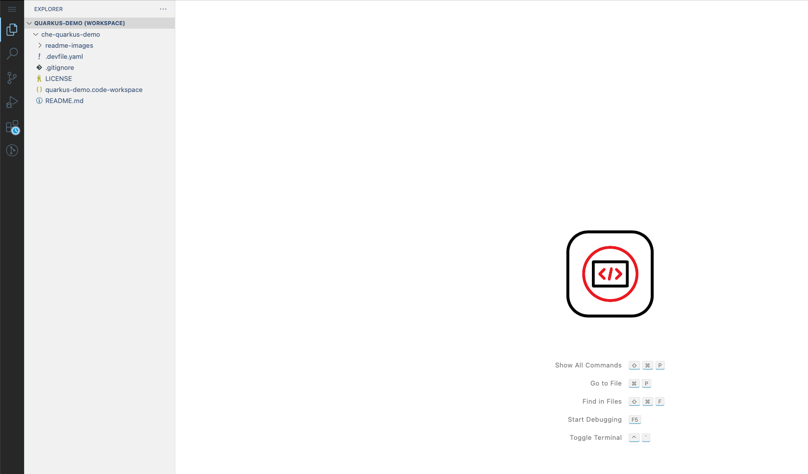
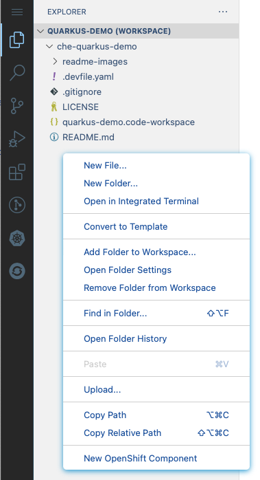
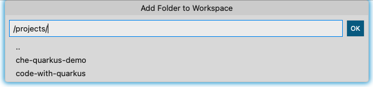
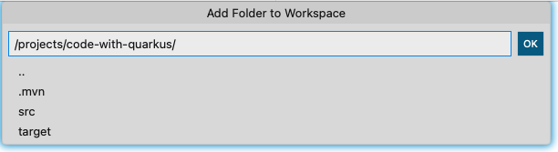
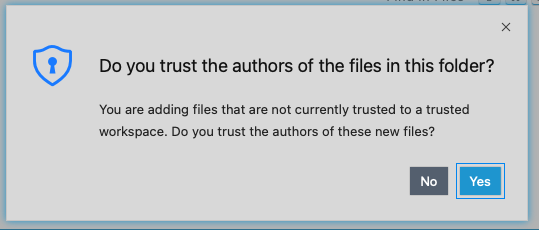

# che-quarkus-workspace

## Work In Progress.  Demo coming soon.

Demo for Quarkus Dev Mode in Eclipse Che

## Install & Configure OpenShift Local

The first step, is to install OpenShift Local if you don't already have it.

1. Go To: [https://developers.redhat.com/products/openshift/overview](https://developers.redhat.com/products/openshift/overview){:target="_blank"}

   

1. Select `Install Red Hat OpenShift on your laptop`

   This will take you to a login page.  If you don't have a Red Hat developer account you will register for one here.  It's free and you'll get access to a lot of ebooks, guides, and tools.

1. From the landing page after you log in, you will need to download two things:

   1. Download the OpenShift Local installation package for your OS and architecture

   1. Download your pull secret.  This will give you access to all of the Operators in the Red Hat operator catalog.

   

1. Install OpenShift Local with the installation package that you downloaded.

1. Open a terminal and prepare your workstation to run the cluster:

   ```bash
   crc setup
   ```

   __Note:__ This will take a while.  OpenShift Local will first download the latest cluster bundle, decompress it, and set up your system to run the cluster.

1. Configure your OpenShift Local cluster: __Note:__ You need at least 16GB of RAM on your workstation, 32GB is better. 

  Adjust the settings below based on your workstation config.

  If you only have 16GB of RAM, change `memory 16384` to `memory 12288`.

  If you only have 2 CPU cores, (4 threads), then change `cpus 6` to `cpus 4`

   ```bash
   crc config set cpus 6
   crc config set memory 12288
   crc config set disk-size 100
   crc config set kubeadmin-password crc-admin
   ```

1. Start OpenShift Local:

   ```bash
   crc start
   ```

   After the cluster starts, you should see output similar to:

   ```bash
   INFO All operators are available. Ensuring stability... 
   INFO Operators are stable (2/3)...                
   INFO Operators are stable (3/3)...                
   INFO Adding crc-admin and crc-developer contexts to kubeconfig... 
   Started the OpenShift cluster.

   The server is accessible via web console at:
     https://console-openshift-console.apps-crc.testing

   Log in as administrator:
     Username: kubeadmin
     Password: crc-admin

   Log in as user:
     Username: developer
     Password: developer

   Use the 'oc' command line interface:
     $ eval $(crc oc-env)
     $ oc login -u developer https://api.crc.testing:6443
   ```

## Install the OpenShift Dev Spaces Operator

1. Launch the OpenShift console in your browser:

   ```bash
   crc console
   ```

1. Log in with user: `kubeadmin`, password: `crc-admin`

1. Navigate to the `Operator Hub`

   

1. Type `dev spaces` into the search, and select `Red Hat OpenShift Dev Spaces`:

   

1. Click `Install`:

   

1. Click `Install`:

   

   The Operator should begin installing:

   

1. Observe the installed Operators, by clicking on `Installed Operators`  underneath `Operator Hub` in the left nav menu bar:

   

## Create the OpenShift Dev Spaces CheCluster Instance

1. Open a terminal and login to the OpenShift Local instance with the CLI:

   ```bash
   oc login -u kubeadmin -p crc-admin https://api.crc.testing:6443
   ```

   ```bash
   cat << EOF | oc apply -f -
   apiVersion: v1
   kind: Namespace
   metadata:
     name: openshift-devspaces
   ---
   apiVersion: org.eclipse.che/v2
   kind: CheCluster
   metadata:
     name: devspaces
     namespace: openshift-devspaces
   spec:
     components:
       cheServer:
         debug: false
         logLevel: INFO
       database:
         credentialsSecretName: postgres-credentials
         externalDb: false
         postgresDb: dbche
         postgresHostName: postgres
         postgresPort: '5432'
         pvc:
           claimSize: 1Gi
       metrics:
         enable: true
     containerRegistry: {}
     devEnvironments:
       secondsOfRunBeforeIdling: -1
       containerBuildConfiguration:
         openShiftSecurityContextConstraint: container-build
       disableContainerBuildCapabilities: false
       defaultEditor: che-incubator/che-code/insiders
       defaultNamespace:
         autoProvision: true
         template: <username>-devspaces
       secondsOfInactivityBeforeIdling: 1800
       storage:
         pvcStrategy: per-user
     gitServices: {}
     networking: {}
   EOF
   ```

   ```bash
   cat << EOF | oc apply -f -
   apiVersion: v1
   kind: Namespace
   metadata:
     name: eclipse-che-images
   ---
   apiVersion: rbac.authorization.k8s.io/v1
   kind: RoleBinding
   metadata:
     name: system:image-puller
     namespace: eclipse-che-images
   roleRef:
     apiGroup: rbac.authorization.k8s.io
     kind: ClusterRole
     name: system:image-puller
   subjects:
   - apiGroup: rbac.authorization.k8s.io
     kind: Group
     name: system:serviceaccounts
   ---
   apiVersion: image.openshift.io/v1
   kind: ImageStream
   metadata:
     name: quarkus
     namespace: eclipse-che-images
   ---
   apiVersion: build.openshift.io/v1
   kind: BuildConfig
   metadata:
     name: quarkus
     namespace: eclipse-che-images
   spec:
     source:
       images:
         - from:
             kind: ImageStreamTag
             name: 'cli:latest'
             namespace: openshift
           paths:
           - destinationDir: .
             sourcePath: /usr/bin/oc
       dockerfile: |
         FROM registry.access.redhat.com/ubi9/ubi-minimal
         ARG USER_HOME_DIR="/home/user"
         ARG WORK_DIR="/projects"
         ARG MAVEN_VERSION=3.8.7
         ARG QUARKUS_VERSION=2.16.1.Final
         ARG BASE_URL=https://apache.osuosl.org/maven/maven-3/\${MAVEN_VERSION}/binaries
         ARG JAVA_PACKAGE=java-17-openjdk-devel
         ARG MANDREL_VERSION=22.3.0.1-Final
         ARG USER_HOME_DIR="/home/user"
         ARG WORK_DIR="/projects"
         ARG GRAALVM_DIR=/opt/mandral
         ARG KUBEDOCK_VERSION=0.9.2
         ENV HOME=\${USER_HOME_DIR}
         ENV BUILDAH_ISOLATION=chroot
         ENV LANG='en_US.UTF-8' LANGUAGE='en_US:en' LC_ALL='en_US.UTF-8'
         ENV MAVEN_HOME=/usr/share/maven
         ENV MAVEN_CONFIG="\${HOME}/.m2"
         ENV GRAALVM_HOME=\${GRAALVM_DIR}
         ENV JAVA_HOME=/etc/alternatives/jre_17_openjdk
         COPY oc /usr/bin/oc
         RUN microdnf --disableplugin=subscription-manager install -y openssl compat-openssl11 libbrotli git tar gzip zip unzip which shadow-utils bash zsh wget jq podman buildah skopeo glibc-devel zlib-devel gcc libffi-devel libstdc++-devel gcc-c++ glibc-langpack-en ca-certificates \${JAVA_PACKAGE}; \
           microdnf update -y ; \
           microdnf clean all ; \
           mkdir -p \${USER_HOME_DIR} ; \
           mkdir -p \${WORK_DIR} ; \
           mkdir -p /usr/local/bin ; \
           setcap cap_setuid+ep /usr/bin/newuidmap ; \
           setcap cap_setgid+ep /usr/bin/newgidmap ; \
           mkdir -p "\${HOME}"/.config/containers ; \
           (echo '[storage]';echo 'driver = "vfs"') > "\${HOME}"/.config/containers/storage.conf ; \
           touch /etc/subgid /etc/subuid ; \
           chmod -R g=u /etc/passwd /etc/group /etc/subuid /etc/subgid ; \
           echo user:20000:65536 > /etc/subuid  ; \
           echo user:20000:65536 > /etc/subgid ; \
           TEMP_DIR="\$(mktemp -d)" ; \
           mkdir -p /usr/share/maven /usr/share/maven/ref ; \
           curl -fsSL -o \${TEMP_DIR}/apache-maven.tar.gz \${BASE_URL}/apache-maven-\${MAVEN_VERSION}-bin.tar.gz ; \
           tar -xzf \${TEMP_DIR}/apache-maven.tar.gz -C /usr/share/maven --strip-components=1 ; \
           ln -s /usr/share/maven/bin/mvn /usr/bin/mvn ; \
           rm -rf "\${TEMP_DIR}" ; \
           mkdir -p \${GRAALVM_DIR} ; \
           TEMP_DIR="\$(mktemp -d)" ; \
           curl -fsSL -o \${TEMP_DIR}/mandrel-java11-linux-amd64-\${MANDREL_VERSION}.tar.gz https://github.com/graalvm/mandrel/releases/download/mandrel-\${MANDREL_VERSION}/mandrel-java17-linux-amd64-\${MANDREL_VERSION}.tar.gz ; \
           tar xzf \${TEMP_DIR}/mandrel-java11-linux-amd64-\${MANDREL_VERSION}.tar.gz -C \${GRAALVM_DIR} --strip-components=1 ; \
           rm -rf "\${TEMP_DIR}" ; \
           TEMP_DIR="\$(mktemp -d)" ; \
           YQ_VER="\$(basename \$(curl -Ls -o /dev/null -w %{url_effective} https://github.com/mikefarah/yq/releases/latest))" ; \
           curl -fsSL -o \${TEMP_DIR}/yq.tar.gz https://github.com/mikefarah/yq/releases/download/\${YQ_VER}/yq_linux_amd64.tar.gz ; \
           tar -xzf \${TEMP_DIR}/yq.tar.gz -C \${TEMP_DIR} ; \
           cp \${TEMP_DIR}/yq_linux_amd64 /usr/local/bin/yq ; \
           chmod +x /usr/local/bin/yq ; \
           rm -rf "\${TEMP_DIR}" ; \
           mkdir -p /usr/local/quarkus-cli/lib ; \
           mkdir /usr/local/quarkus-cli/bin ; \
           TEMP_DIR="\$(mktemp -d)" ; \
           curl -fsSL -o \${TEMP_DIR}/quarkus-cli.tgz https://github.com/quarkusio/quarkus/releases/download/\${QUARKUS_VERSION}/quarkus-cli-\${QUARKUS_VERSION}.tar.gz ; \
           tar -xzf \${TEMP_DIR}/quarkus-cli.tgz -C \${TEMP_DIR} ; \
           cp \${TEMP_DIR}/quarkus-cli-\${QUARKUS_VERSION}/bin/quarkus /usr/local/quarkus-cli/bin ; \
           cp \${TEMP_DIR}/quarkus-cli-\${QUARKUS_VERSION}/lib/quarkus-cli-\${QUARKUS_VERSION}-runner.jar /usr/local/quarkus-cli/lib ; \
           rm -rf "\${TEMP_DIR}" ; \
           chmod +x /usr/local/quarkus-cli/bin/quarkus ; \
           ln -s /usr/local/quarkus-cli/bin/quarkus /usr/local/bin/quarkus ; \
           TEMP_DIR="\$(mktemp -d)" ; \
           cd "\${TEMP_DIR}"; \
           curl -fsSL -o kubedock.tgz https://github.com/joyrex2001/kubedock/releases/download/\${KUBEDOCK_VERSION}/kubedock_\${KUBEDOCK_VERSION}_linux_amd64.tar.gz ; \
           tar -xzf kubedock.tgz ; \
           cp kubedock /usr/local/bin ; \
           chmod +x /usr/local/bin/kubedock ; \
           rm -rf "\${TEMP_DIR}" ; \
           chgrp -R 0 /home ; \
           chmod -R g=u /home \${WORK_DIR}
         USER 10001
         WORKDIR \${WORK_DIR}
     strategy:
       type: Docker
     output:
       to:
         kind: ImageStreamTag
         name: quarkus:latest
   EOF
   ```

1. Build the image:

   ```bash
   oc start-build quarkus -n eclipse-che-images -F
   ```

## Log into OpenShift Dev Spaces

1. Get the URL for the dev-spaces route:

   ```bash
   echo https://$(oc get route devspaces -n openshift-devspaces -o jsonpath={.spec.host})
   ```

1. Paste that URL into your browser and click `Log in with OpenShift`

   

1. Log in with user: `developer`, password: `developer`:

   

1. The first time, you will be asked to authorize access:

   Click `Allow selected permissions`:

   

1. You should now be at the Dev Spaces dashboard:

   

## Add a role to your user

At this point we need to take a quick detour back to the terminal with `kubeadmin` privileges.  One capability that we need to enable Quarkus Dev Services, is not yet in Dev Spaces.  We need the ability to create `port-forward` from a pod in our namespace back to a running shell in our workspace.

Let's add that ability now, by creating a new `ClusterRole`, and binding our user to it in the namespace that Dev Spaces has provisioned for us.

1. Open a terminal and login to the OpenShift Local instance with the CLI:

   ```bash
   oc login -u kubeadmin -p crc-admin https://api.crc.testing:6443
   ```

1. Create the cluster role:

   ```bash
   cat << EOF | oc apply -f -
   apiVersion: rbac.authorization.k8s.io/v1
   kind: ClusterRole
   metadata:
     name: quarkus-dev-services
   rules:
   - apiGroups:
     - batch
     resources:
     - jobs
     - jobs/status
     verbs:
     - get
     - list
     - watch
   - apiGroups:
     - ""
     resources:
     - pods/portforward
     verbs:
     - get
     - list
     - watch
     - create
     - delete
     - deletecollection
     - patch
     - update
   EOF
   ```

1. Add that role to your user in the provisioned namespace:

   ```bash
   oc policy add-role-to-user quarkus-dev-services developer -n developer-devspaces
   ```

## Create A Workspace




## Demo Quarkus Dev Services


```bash
cd /projects
```

```bash
quarkus create
```

```bash
Creating an app (default project type, see --help).
Looking for the newly published extensions in registry.quarkus.io
-----------

applying codestarts...
📚  java
🔨  maven
📦  quarkus
📝  config-properties
🔧  dockerfiles
🔧  maven-wrapper
🚀  resteasy-reactive-codestart

-----------
[SUCCESS] ✅  quarkus project has been successfully generated in:
--> /projects/che-quarkus-demo/code-with-quarkus
-----------
Navigate into this directory and get started: quarkus dev
bash-5.1$ 
```

```bash
cd code-with-quarkus
```

```bash
mvn package
```

```bash
[INFO] 
[INFO] -------------------------------------------------------
[INFO]  T E S T S
[INFO] -------------------------------------------------------
[INFO] Running org.acme.GreetingResourceTest
2023-02-03 18:41:00,691 INFO  [io.quarkus] (main) code-with-quarkus 1.0.0-SNAPSHOT on JVM (powered by Quarkus 2.16.1.Final) started in 11.094s. Listening on: http://localhost:8081
2023-02-03 18:41:01,201 INFO  [io.quarkus] (main) Profile test activated. 
2023-02-03 18:41:01,201 INFO  [io.quarkus] (main) Installed features: [cdi, resteasy-reactive, smallrye-context-propagation, vertx]
[INFO] Tests run: 1, Failures: 0, Errors: 0, Skipped: 0, Time elapsed: 21.581 s - in org.acme.GreetingResourceTest
2023-02-03 18:41:08,096 INFO  [io.quarkus] (main) code-with-quarkus stopped in 0.304s
[INFO] 
[INFO] Results:
[INFO] 
[INFO] Tests run: 1, Failures: 0, Errors: 0, Skipped: 0
[INFO] 
[INFO] 
[INFO] --- maven-jar-plugin:2.4:jar (default-jar) @ code-with-quarkus ---
[INFO] Building jar: /projects/code-with-quarkus/target/code-with-quarkus-1.0.0-SNAPSHOT.jar
[INFO] 
[INFO] --- quarkus-maven-plugin:2.16.1.Final:build (default) @ code-with-quarkus ---
[INFO] [io.quarkus.deployment.QuarkusAugmentor] Quarkus augmentation completed in 8193ms
[INFO] ------------------------------------------------------------------------
[INFO] BUILD SUCCESS
[INFO] ------------------------------------------------------------------------
[INFO] Total time:  55.588 s
[INFO] Finished at: 2023-02-03T18:41:17Z
[INFO] ------------------------------------------------------------------------
```

```bash
quarkus ext add oidc
```









`pom.xml`

```xml
<dependency>
  <groupId>io.quarkus</groupId>
  <artifactId>quarkus-test-keycloak-server</artifactId>
  <scope>test</scope>
</dependency>
```

`src/test/java/org/acme/GreetingResourceTest.java`

```java
package org.acme;

import io.quarkus.test.junit.QuarkusTest;
import org.junit.jupiter.api.Test;
import static io.restassured.RestAssured.given;
import static org.hamcrest.CoreMatchers.is;
import io.quarkus.test.keycloak.client.KeycloakTestClient;

@QuarkusTest
public class GreetingResourceTest {

    KeycloakTestClient keycloak = new KeycloakTestClient();

    @Test
    public void testHelloEndpoint() {
        given()
          .auth().oauth2(getAccessToken("alice"))
          .when().get("/hello")
          .then()
             .statusCode(200)
             .body(is("Hello from RESTEasy Reactive"));
    }
    protected String getAccessToken(String user) {
        return keycloak.getAccessToken(user);
    }
}
```

`src/main/java/org/acme/GreetingResource.java`

```java
package org.acme;

import javax.ws.rs.GET;
import javax.ws.rs.Path;
import javax.ws.rs.Produces;
import javax.ws.rs.core.MediaType;
import io.quarkus.security.Authenticated;
import javax.annotation.security.RolesAllowed;

@Path("/hello")
@Authenticated
public class GreetingResource {

    @GET
    @Produces(MediaType.TEXT_PLAIN)
    @RolesAllowed({"user","admin"})
    public String hello() {
        return "Hello from RESTEasy Reactive";
    }
}
```


```bash
kubedock server --port-forward
```

```bash

```

```bash
export TESTCONTAINERS_RYUK_DISABLED=true
export TESTCONTAINERS_CHECKS_DISABLE=true
export DOCKER_HOST=tcp://127.0.0.1:2475
```

```bash
mvn test
```

